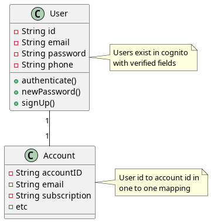

# Project: Janus

Greek god of gates and passages.

## Setup

### 1. API key

Use a `.env` file to define `API_KEY=<KEY>`.

Use `openssl rand -hex 32` to generate a random key.

### 2. Install Serverless

Depending on your system install `serverless` CLI application.

`yarn global add serverless` or `npm install -g serverless`

### 3. AWS Credentials

Use the `aws configure` cli and command to configure aws and login.

For more details see [aws quickstart](https://docs.aws.amazon.com/cli/latest/userguide/getting-started-quickstart.html) or [serverless docs](https://www.serverless.com/framework/docs).

### 4. Dotnet Core 6

Install `dotnet core` for your system.

## Dev

### 1. `./build.sh`

Build the function package

### 2. `serverless deploy`

Deploy the package

### 3. `serverless invoke -f janus -p data/authenticate.json`

Test the authenticate lambda with some sample data

## API

### Authorization

Requires an `email` and a `password`.

Returns an authenticated JWT token that can be decoded for the ID (sub) and email

If an authorization requires a new password from signup, will return 300 with a session token to use to reset.

### Signup

Requires an `email` and a `temp password`

Returns the ID and email

### New Password

Requires an `email` and a `new password`

Returns an authenticated JWT token for the session.

## Data

## Test

### Postman

Use the [postman janus-test](https://micrantha.postman.co/workspace/janus-test~8e5a5f6e-8288-49e0-9120-503cbe76537e/collection/18430765-ee086919-a64a-473e-b28f-024dcc95b05e?action=share&creator=18430765&active-environment=18430765-6ef21def-45ce-4f3c-ad10-ed66a71c71cb) project to run tests.

### Flows

#### Signup a user

##### 1. `curl -v -H "Content-Type: application/json" -H "X-Api-Key: <APIKEY>" -d '{"email":"<EMAIL>","password":"<TEMPASS>"}' https://<URL>/signup`

Authenticate the user to get the session for setting the password:

##### 2. `curl -v -H "Content-Type: application/json" -H "X-Api-Key: <APIKEY>" -d '{"email":"<EMAIL>","password":"<PASSWORD>"}' https://<URL>/authenticate`

Grab the session from the response and set the password:

##### 3. `curl -v -H "Content-Type: application/json" -H "X-Api-Key: <APIKEY>" -d '{"email":"<EMAIL>","password":"<PASSWORD>","session":"<SESSION>"}' https://<URL>/reset`

#### Authenticate a user

##### 1. `curl -v -H "Content-Type: application/json" -H "X-Api-Key: <APIKEY>" -d '{"email":"<EMAIL>","password":"<PASSWORD>"}' https://<URL>/authenticate`
